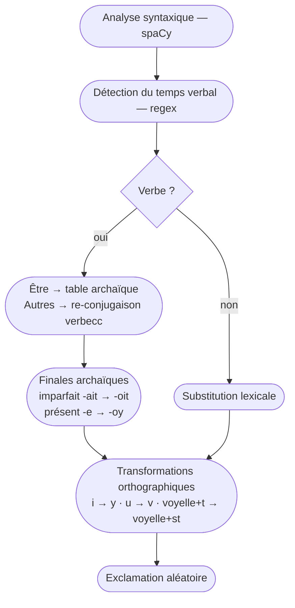

# Vetuste Scripteur

Transforme une phrase en français moderne en vieux français façon **Les Visiteurs** — ni académique, ni exact, entièrement drolatique.

## Exemples

| Moderne | Archaïque |
| --- | --- |
| Je mange une pomme dans le jardin | Je rypaylloy vne pomme en le jardyn |
| Il ne buvait pas assez d'eau | Corbleu ! yl ne chopynoyst poynst prou d'eau |
| Elle chantait une belle chanson | Elle entonnoist vne belle rystournelle |
| Je cherchais mon portable | Je guettoys myen parchemyn volant |
| Madame, vous êtes très belle | Ma gente dame, vovs estez fort belle |

## Installation

```bash
uv sync
```

Le modèle de langue français est inclus comme dépendance (`fr-core-news-sm`).

## Utilisation

### CLI

```bash
# Phrase en argument
python main.py "Je mange une pomme"

# Exemples intégrés
python main.py
```

### API

```bash
uvicorn main:app --reload
```

- Interface web : [http://127.0.0.1:8000](http://127.0.0.1:8000)
- Endpoint JSON : `GET /translate?phrase=...`
- Docs auto : [http://127.0.0.1:8000/docs](http://127.0.0.1:8000/docs)

## Pipeline de transformation



## Règles appliquées

1. **Substitution lexicale** — ~150 mots remplacés : `monsieur` → `messire`, `voiture` → `carriole`, `portable` → `parchemin volant`, etc.
2. **Re-conjugaison des verbes** — le verbe moderne est remplacé par son équivalent archaïque et re-conjugué au même temps et à la même personne (`manger` → `ripailler`, `boire` → `chopiner`, `voir` → `mirer`…)
3. **Finales de l'imparfait** — `-ais`/`-ait`/`-aient` → `-ois`/`-oit`/`-oient`
4. **Finales du présent** — formes en `-e` → `-oy` (`mange` → `mangoy`)
5. **Être** — conjugaison manuelle : `est`/`suis` → `estoy`, `êtes` → `estez`, etc.
6. **Substitutions orthographiques aléatoires** — `i` → `y` (~40 %), `u` → `v` (~30 %)
7. **Insertion du `s` caduc** — voyelle + `t` → voyelle + `st` (`faites` → `faistes`, `ritournelle` → `ristournelle`)
8. **Exclamations** — ajoutées aléatoirement en début de phrase : *Corbleu !*, *Passepoil !*, *Fientrecul !*…

## Stack

- [spaCy](https://spacy.io/) `fr_core_news_sm` — analyse morpho-syntaxique
- [verbecc](https://github.com/bretttolbert/verbecc) — conjugaison des verbes archaïques
- [FastAPI](https://fastapi.tiangolo.com/) — API et interface web

## Ressources lexicographiques

- [Dictionnaire français médiéval](http://buze.michel.chez.com/lavache/dictionnaire_francais_medieval_moyen_age.htm)
